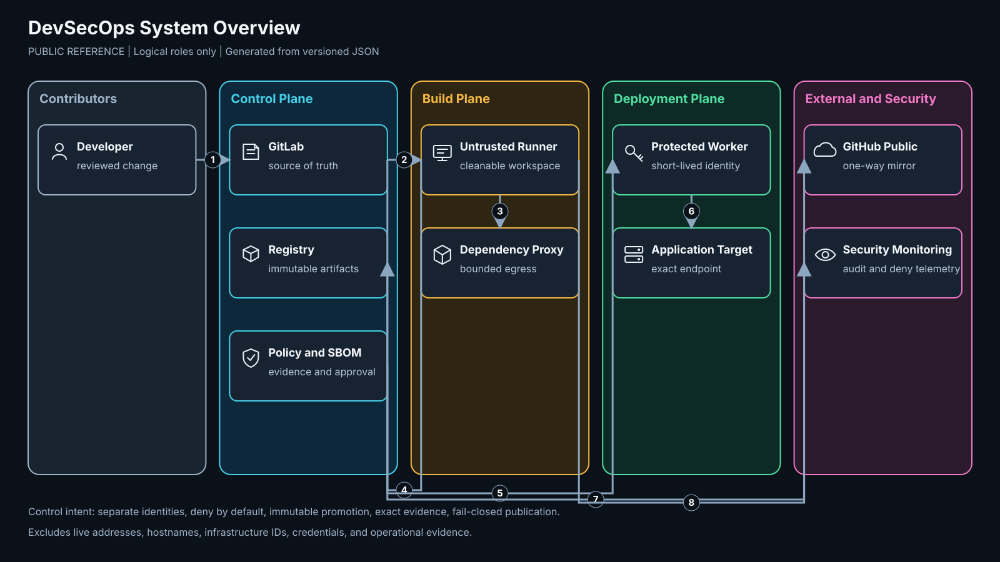

# DevSecOps Pipeline Public Reference

A sanitized, buildable reference for a self-hosted DevSecOps delivery plane. GitLab remains the development source of truth. GitHub is a one-way public mirror.

This repository explains how to separate untrusted builds from source-control and deployment authority, validate source and dependencies, create SBOM and policy evidence, promote one immutable digest, and publish a safe public mirror.

## Relationship to the public SOC pipeline

The platform is designed to build, scan, attest, and release projects such as [secdoc/soc-pipeline-public](https://github.com/secdoc/soc-pipeline-public). The linkage is both documented and machine-readable:

- `integrations/soc-pipeline-public.json` declares the public project and expected gates.
- `scripts/verify_linkage.py` verifies the live GitHub repository and required files.
- `.github/workflows/validate.yml` runs the linkage check weekly and on demand.
- `.gitlab-ci.yml` can run the same check when the GitLab runner has approved outbound access.

No private SOC configuration or operational evidence is imported.

## What is included

- Three-plane architecture: control, hostile-by-default build, and protected deployment.
- Physical and logical, trust-boundary, artifact-flow, and recovery diagrams.
- Tool-selection record and accepted tradeoffs.
- GitLab and GitHub validation workflows.
- Risk-based release policy with expiring exception rules.
- Repository sanitization and secret-scanning gate.
- Immutable artifact receipt generator.
- Fail-closed GitLab-to-GitHub mirror helper.
- Tests that exercise policy, sanitization, receipt, diagram, and linkage behavior.
- Build, operations, recovery, rollback, and adoption documentation.

## Quick start

Requirements: Python 3.11 or newer, Git, and an XML parser from the Python standard library.

```bash
python3 scripts/render_architecture.py
python3 -m unittest discover -s tests -v
python3 scripts/validate_repository.py .
python3 scripts/evaluate_release.py   --policy policies/release-policy.json   --findings examples/release/findings.json   --exceptions examples/release/exceptions.json
python3 scripts/create_receipt.py   --artifact examples/release/artifact.txt   --sbom examples/release/sbom.cdx.json   --output /tmp/release-receipt.json
```

## Architecture



The detailed views and text equivalents are in `docs/ARCHITECTURE.md`.

## Authority and publication

1. Changes land in GitLab through review and protected-branch controls.
2. GitLab CI validates tests, policy, diagrams, and repository sanitization.
3. A protected mirror identity pushes the accepted Git ref to GitHub.
4. The mirror helper refuses destination divergence and never performs a force push.
5. GitHub Actions independently reruns public validation and linkage checks.

GitHub is not a second writable source of truth. Pull requests opened on GitHub are useful for discussion, but accepted changes must be applied and reviewed in GitLab before the public mirror advances.

## Security boundary

This is a generalized reference, not an export of a live environment. It intentionally excludes:

- real IP addresses, hostnames, domains, usernames, VM or VLAN identifiers
- credentials, keys, certificates, fingerprints, and token-bearing URLs
- live firewall rules, inventory, backups, logs, and acceptance evidence
- internal repository manifests and protected deployment targets
- vulnerability databases and unlicensed third-party rules

See `docs/SANITIZATION.md` for the publication contract.

## Documentation map

- `docs/ARCHITECTURE.md`: boundaries, flows, and diagrams
- `docs/BUILD.md`: installation and configuration
- `docs/PIPELINE-GATES.md`: gate order, evidence, and failure behavior
- `docs/TOOL-SELECTION.md`: tools selected, alternatives, and tradeoffs
- `docs/OPERATIONS.md`: operations, upgrades, incident handling, and rollback
- `docs/REBUILD-DR.md`: clean rebuild and disaster recovery
- `docs/CONTROL-MAP.md`: NIST SSDF and NIST SP 800-53 mapping
- `docs/THREAT-MODEL.md`: threats, controls, residual risk, and abuse cases
- `docs/SANITIZATION.md`: public-release rules and automated checks
- `docs/adr/`: architecture decisions

## Status and limitations

The repository validates its own reference implementation. It does not claim that a reader's deployment is secure merely because CI passes. Network isolation, workload identity, backup restoration, signature verification, target authorization, and telemetry must be tested in the adopter's environment.

## License

Code and configuration are Apache-2.0. Documentation and diagrams are CC BY 4.0. Attribution is required under both. See `LICENSE`, `LICENSE-docs`, `LICENSING.md`, and `NOTICE`.
