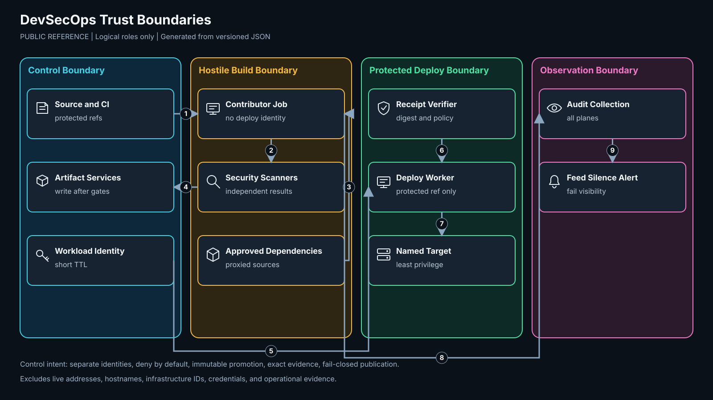
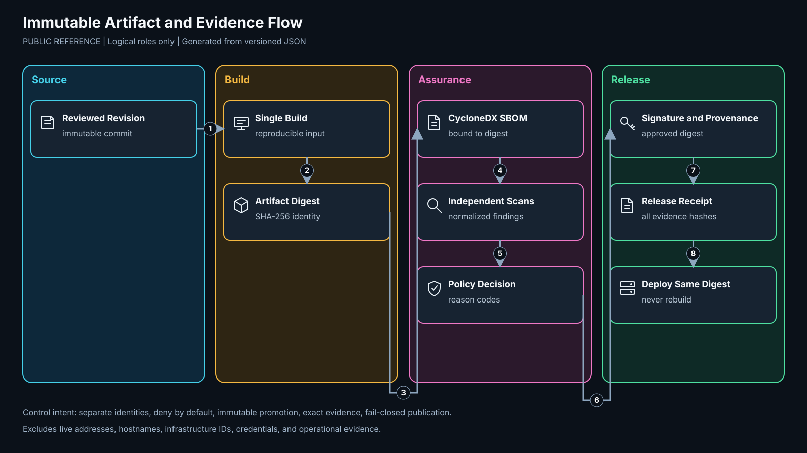
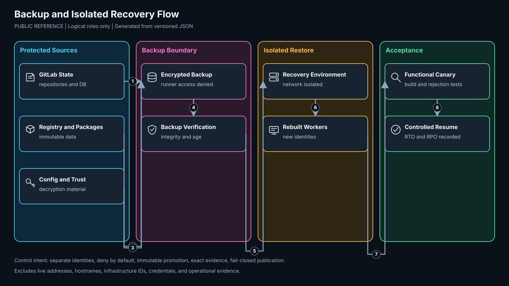

# Architecture

Artifact ID: DEVSECOPS-PUBLIC-ARCH-001
Version: 1.0
Classification: Public
State: Reference implementation
Scope: GitLab-centered build, security, release, deployment, and public mirroring
Exclusions: Product-specific infrastructure identifiers and live operational evidence

## Trust model

The design separates three execution roles. Network separation and identity separation are both required.

| Plane | Primary components | Trust position | Prohibited access |
|---|---|---|---|
| Control | GitLab, registry, policy, package proxy, SBOM inventory | Privileged service plane | Direct production administration through contributor jobs |
| Build | Ephemeral or cleanable CI workers | Hostile by default | Hypervisor, storage, control host OS, production, reusable deploy credentials |
| Deployment | Protected deployment workers | Narrow production authority | Merge-request execution, arbitrary Internet egress, rebuilding artifacts |
| Security observation | SIEM and alerting | Observes all planes | Acting as transit between planes |

## Views

### System overview

The source repository enters GitLab. Untrusted workers test and scan through approved dependency services. Protected workers verify the approved receipt and deploy the exact immutable digest. Telemetry leaves each plane for the security system.

### Trust boundaries

Contributor-controlled jobs remain inside the build boundary. Registry publication and deployment require protected refs, separate identities, and policy evidence. Segment membership does not replace authorization.

### Artifact flow

One build produces an immutable artifact. SBOM, independent scan results, policy decision, signature, and provenance bind to its digest. Deployment verifies the receipt and does not rebuild.

### Recovery flow

Backups include GitLab state, registries, policy, configuration, and secrets needed to decrypt application data. Recovery is accepted only after an isolated restore and functional verification. Snapshots are not the sole backup.

## Required flows

| ID | Source | Destination | Purpose | Gate |
|---|---|---|---|---|
| F1 | Developer | GitLab | reviewed source changes | authenticated user, protected branch, approval |
| F2 | GitLab | Build worker | isolated job execution | project-scoped runner identity |
| F3 | Build worker | Dependency services | package and vulnerability data | approved proxy, bounded egress |
| F4 | Build worker | Registry and evidence store | immutable output and evidence | digest binding, policy pass |
| F5 | GitLab | Deployment worker | protected release job | protected ref and environment |
| F6 | Deployment worker | Target | verified digest activation | narrow workload identity and endpoint |
| F7 | GitLab mirror worker | GitHub | one-way public ref publication | sanitized tree, no divergence, no force |
| F8 | All planes | Security system | audit and deny telemetry | exact destination, feed-silence monitoring |

## Failure domains

A single control-plane instance reduces operational complexity but creates a control-plane outage domain. Build workers should be disposable and spread across failure domains only when capacity warrants it. Deployment workers remain separate even when this costs another host or VM. Backup and restore must survive loss of the control-plane host.
