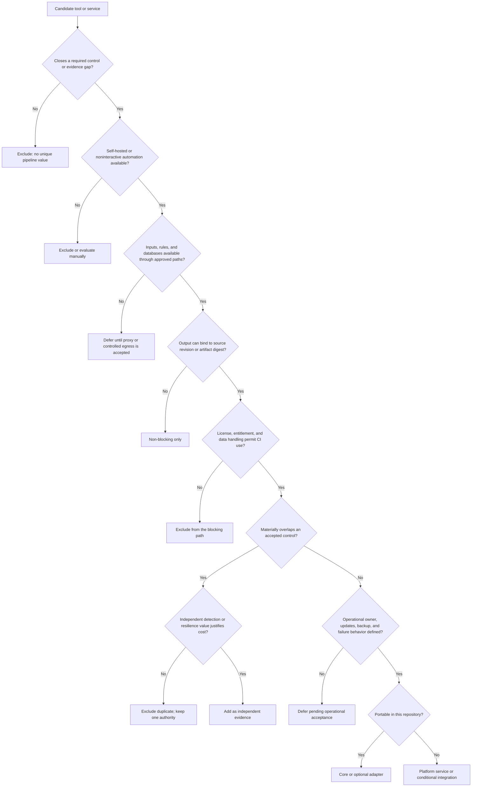

# Tool Selection Decisions

The design uses replaceable stage roles. Security properties and evidence contracts matter more than product names. This page distinguishes tools that run in this public repository, tools present in the optional security adapter, supporting platform services, deferred integrations, and rejected choices.

## Status meanings

| Status | Meaning |
|---|---|
| Core | Runs in the repository's default validation and release workflow. |
| Optional adapter | Defined in `.gitlab/security-toolchain.yml`; runs only when `SECURITY_TOOLCHAIN_READY=true` and every required command and ruleset is present. |
| Platform service | Selected in the reference architecture, but deployed and operated outside this repository. |
| Conditional | Added only when the repository contains the relevant language, artifact, or running test target. |
| Deferred | A reasonable integration, but not part of the current portable baseline. It must pass its own acceptance gate before becoming blocking. |
| Excluded | Deliberately not part of the authoritative blocking path under the stated conditions. |

## Decision tree

The tree is fail-closed. A downloaded binary or successful one-off scan does not make a tool an accepted release gate. A blocking tool also needs deterministic invocation, maintained data and rules, normalized findings, an outage policy, reason-coded exceptions, and evidence bound to the exact revision or artifact digest.

## Current pipeline composition

### Core repository controls

These controls run without the external scanner stack and validate the public reference itself.

| Stage | Tool | Why included | Boundary |
|---|---|---|---|
| Source and CI authority | [GitLab Community Edition](https://github.com/gitlabhq/gitlabhq) | Self-hosted source of truth, protected refs, CI orchestration, and registry integration. | The GitHub repository is an official mirror. GitLab CE requires custom integration for some security and policy features. |
| Runner execution | [GitLab Runner](https://github.com/gitlabhq/gitlab-runner) | Project-scoped scheduling and separate identities for hostile build and protected deployment roles. | Build and deployment jobs must not share an identity or worker. |
| Repository validation and policy | [CPython](https://github.com/python/cpython) standard library scripts | Keeps the reference validation, policy evaluation, release receipt, linkage check, and mirror logic auditable and dependency-light. | These scripts validate the reference; they do not replace application-specific testing. |
| Versioning and publication | [Git](https://github.com/git/git) plus repository-scoped SSH | Supports exact commit readback and one-way publication without a broad GitHub token. | The mirror refuses divergence and never force-pushes. |
| Public verification | GitHub Actions using the open-source [Actions runner](https://github.com/actions/runner) | Independently reruns public validation after GitLab acceptance. | GitHub evidence is downstream and cannot authorize the release. |

### Optional security-toolchain adapter

The adapter runs all listed commands as one required job when enabled. It fails if a command or approved Semgrep ruleset is missing.

| Control | Tool | Why included | Known overlap or limitation |
|---|---|---|---|
| Full-history secret detection | [Gitleaks](https://github.com/gitleaks/gitleaks) | Purpose-built Git history scanning and redacted findings. | Trivy also detects secrets, but Gitleaks retains independent history-focused coverage. |
| Vulnerability, secret, and misconfiguration scan | [Trivy](https://github.com/aquasecurity/trivy) | One self-hostable CLI covers repositories, dependencies, configuration, and container-oriented inputs. | Broad coverage needs policy tuning and current vulnerability data. |
| Static application security testing | [Semgrep Community Edition](https://github.com/semgrep/semgrep) | Supports many languages and reviewable custom rules without requiring the source authority to move to another platform. | Community rules require ownership, pinning, and false-positive management. |
| Infrastructure-as-code analysis | [Checkov](https://github.com/bridgecrewio/checkov) | Broad IaC policy coverage and deterministic CLI execution. | Overlaps Trivy misconfiguration checks; retain only rules that produce distinct evidence. |
| SBOM generation | [Syft](https://github.com/anchore/syft) | Generates CycloneDX output for repositories, filesystems, and container images. | Ecosystem detection varies. Validate the SBOM and bind its hash to the artifact digest. |
| Malware scan | [ClamAV](https://github.com/Cisco-Talos/clamav) | Adds signature and heuristic malware detection before publication or promotion. | It does not replace SAST, vulnerability scanning, sandboxing, or endpoint EDR. |

### Selected platform services

These components support the end-to-end architecture. They are not installed or proven by cloning this repository.

| Role | Selected component | Why selected | Operational cost or limit |
|---|---|---|---|
| Rootless build engine | [Podman](https://github.com/podman-container-tools/podman) | Avoids granting untrusted jobs the host Docker socket and supports rootless OCI workflows. | Rootless storage and cleanup must use the actual runner UID and be tested after every job. |
| Dependency and image proxy | [Nexus Repository](https://github.com/sonatype/nexus-public) | Provides one controlled path for multiple package ecosystems and OCI content when direct runner Internet access is denied. | It adds stateful backup, upgrade, entitlement, and cache-integrity work. |
| SBOM inventory | [OWASP Dependency-Track](https://github.com/DependencyTrack/dependency-track) | Retains CycloneDX inventories and tracks component risk across releases. | Ingestion is asynchronous, so a submission response alone is not a release decision. |
| Artifact signing and attestations | [Cosign](https://github.com/sigstore/cosign) | Binds signatures and attestations to immutable OCI or file digests. | Trust roots, signer isolation, verification policy, and recovery remain operator responsibilities. |
| Workload secrets and signing policy | [HashiCorp Vault](https://github.com/hashicorp/vault) | Supports short-lived workload identity, PKI, transit signing, and narrowly scoped policy. | Current Vault releases are source-available rather than OSI open source. [OpenBao](https://github.com/openbao/openbao) is the open-source alternative to assess when license requirements demand it. |
| Endpoint and security telemetry | [Wazuh](https://github.com/wazuh/wazuh) with [Graylog](https://github.com/Graylog2/graylog2-server) | Separates endpoint detection, log transport, search, retention, and pipeline-deny evidence from CI authority. | Parser maintenance, feed-silence monitoring, backup, and high-availability design are separate operational duties. Check each project's current license before redistribution. |
| SBOM format | [CycloneDX](https://github.com/CycloneDX/specification) | Machine-readable component inventory that can be hashed, retained, and submitted to multiple analysis tools. | An SBOM is evidence, not a vulnerability verdict. Completeness must be validated per ecosystem. |

## Conditional and deferred tools

| Tool | State | Decision and activation gate |
|---|---|---|
| [Grype](https://github.com/anchore/grype) | Deferred from the bundled adapter; valid independent scanner | Add when its database is delivered through an approved path and findings are normalized with Trivy by component, vulnerability, package location, fix state, and artifact digest. Independent results can reduce a single-scanner blind spot, but duplicate findings must not create duplicate exceptions. |
| [Hadolint](https://github.com/hadolint/hadolint) | Conditional | Run for repositories that contain Dockerfiles. Do not impose it on repositories with no Docker build context. |
| [ShellCheck](https://github.com/koalaman/shellcheck) | Conditional | Run for shell-bearing repositories. Pin the version and treat justified directives as reviewed policy exceptions. |
| [OWASP ZAP](https://github.com/zaproxy/zaproxy) | Conditional DAST | Run only against an isolated, explicitly authorized test target. It is not a source-only gate and must not scan production by default. |
| [SonarQube Community Build](https://github.com/SonarSource/sonarqube) | Deferred centralized analysis | Useful for longitudinal code quality and project governance, but it adds a stateful service, database, scanner-runtime compatibility, tokens, backup, restore, and availability dependencies. It supplements rather than silently replaces Semgrep and language-native tests. Make it blocking only after representative pipelines and outage behavior pass acceptance. |

## Excluded choices and rationale

| Candidate | Decision | Why excluded from the current blocking path | Revisit trigger |
|---|---|---|---|
| [Qualys Community Edition](https://www.qualys.com/community-edition/) and [QScanner](https://docs.qualys.com/en/qscanner/latest/qscanner_usage/use_qscanner.htm) | Excluded as an authoritative blocking gate | The Community Edition entitlement does not establish the required Container Security policy evaluation, supported noninteractive CI use, capacity, service behavior, or acceptable source, image, and SBOM data handling. A downloadable scanner alone does not close those gaps. No suitable open-source GitHub repository exists for this commercial service. | Written and technically verified entitlement for QScanner, policy evaluation, API automation, sufficient capacity, data lifecycle, licensing, and acceptable availability. Start non-blocking. |
| GitLab paid security templates | Excluded from the portable CE baseline | The reference targets GitLab CE and cannot claim paid-tier controls are available. | A documented tier change with license, feature, migration, and rollback review. |
| GitHub Advanced Security as release authority | Excluded | GitLab is the source of truth. Making a GitHub-hosted control authoritative would split acceptance state and create circular publication dependencies. | None while GitLab remains authoritative. Downstream GitHub checks may remain independent evidence. |
| [CodeQL](https://github.com/github/codeql) as the default SAST gate | Excluded from the baseline | The open repository contains queries and libraries, but the complete operational and licensing model is not equivalent to a portable self-hosted GitLab CE scanner baseline. Semgrep provides the selected portable default. | A separately reviewed CodeQL CLI license, supported languages, runner path, database build, policy mapping, and GitLab evidence contract. |
| Standalone [tfsec](https://github.com/aquasecurity/tfsec) | Excluded as a separate default job | Its functionality is now part of Trivy. A second default invocation adds maintenance and duplicate findings without a distinct control objective. | A measured rule-coverage gap that standalone tfsec uniquely closes. |
| [Kubernetes executor](https://github.com/kubernetes/kubernetes) and [Argo CD](https://github.com/argoproj/argo-cd) | Out of scope for the initial reference | They add cluster administration, admission policy, workload identity, network policy, and recovery complexity that is not required to prove the three-plane model. | Workload scale or deployment requirements justify a separately threat-modeled orchestration plane. |
| Commercial repository, SCA, and SAST suites | Not selected by default | They can be valid alternatives, but closed licensing and entitlement prevent this public reference from making them reproducible defaults. | An adopter documents entitlement, automation, data handling, evidence mapping, outage behavior, and exit strategy. |

## Architectural shortcuts that are never tool substitutions

The following choices are rejected even if a product makes them convenient:

- one runner for untrusted build and protected deployment
- direct Internet access from every job instead of approved dependency paths
- mounting the host Docker socket into untrusted jobs
- rebuilding an artifact in each environment
- storing long-lived production secrets in project variables
- severity-only gates without exploitability, fixability, ownership, and exception expiry
- counting a submitted asynchronous scan as a completed decision
- bidirectional GitLab and GitHub synchronization

## Adding or replacing a tool

1. Record the control objective and the gap in current evidence.
2. Confirm the license, entitlement, supported automation, and submitted-data lifecycle.
3. Pin the tool, rules, and data source. Define approved delivery without broad runner egress.
4. Define normalized output, reason codes, severity mapping, deduplication, and exception ownership.
5. Bind evidence to the source revision and, where applicable, the immutable artifact digest.
6. Test positive findings, clean results, missing data, stale data, malformed output, timeout, and service outage.
7. Run non-blocking on representative repositories and measure unique findings, latency, noise, and availability.
8. Promote to blocking only through a reviewed GitLab change with rollback and monitoring.
9. Update this page, `docs/PIPELINE-GATES.md`, build and recovery instructions, and the active knowledge base in the same change.
